<p align="center">
  
</p>

<p align="center">
  <a href="LICENSE"></a>
  
  
  
  
</p>

<h1 align="center">Bilingual Translate</h1>
<p align="center"><b>In-page translation, the way it should work.</b><br>
The original text stays where it is, and the translation appears right below it. No tab switching, no copy-paste, no Pro tier, no account. You open a page, you read it in both languages.</p>

<p align="center">
  
</p>

It started as a Safari extension (that's why the codebase says Safari), and now runs in Chrome too — same code, one build.

## What it does

- **Translates pages in place** — every paragraph gets its translation injected right underneath, so you read original and translation together.
- **Select-to-translate** — highlight any text and a tooltip shows the translation.
- **Always translate this site** — tick a box in the popup and the page translates itself on every load. No clicks.
- **Keyboard shortcut** — `Alt+A` (`⌥A` on Mac), rebindable in `chrome://extensions/shortcuts`.
- **Three view modes** — Bilingual, Original-only, Translation-only.
- **Dynamic pages work** — infinite scroll and lazy-loaded content get translated as they appear.
- **Works out of the box** — ships with a keyless Google Translate provider, so you can install and translate immediately.
- **Portable config** — import/export your providers as JSON to move between machines or share with a friend.

<p align="center">
  
  &nbsp;&nbsp;
  
</p>

## Any AI provider, your own keys

The translation backend is just data — nothing is hardcoded. Pick a preset or define your own service in the settings:

| Provider | Notes |
|---|---|
| **Google Translate (free)** | The keyless default — no signup |
| **OpenAI-compatible** | OpenAI, DeepSeek, Groq, OpenRouter, Together, or local Ollama |
| **DeepL** / **Google Cloud** | Official translation APIs |
| **Anthropic Claude** | For LLM-quality, context-aware translation |

Every provider is just URL + key + model. Add anything that speaks one of these APIs, hit **Test** to check it, set it as default. Keys live in your browser's local storage and are only ever sent to the provider you picked. **Nothing phones home. No accounts, no tracking, no telemetry, no "Pro" badge.**

## Install (Chrome)

1. Clone or download the repo.
2. Open `chrome://extensions`, turn on **Developer mode**, click **Load unpacked**.
3. Pick the `AITranslate/chrome-dist/` folder.
4. Click the extension icon, choose your languages, hit **Translate**.

The settings page (right-click the icon → Options, or the gear in the popup) is where you add providers and keys.

## Safari

Built as a Safari Web Extension first, so the code is there too. Safari wraps web extensions in a native app shell, which you generate with `xcrun safari-web-extension-converter` — the extension code itself is the same `src/` tree. `build.js` produces a Safari-compatible bundle (IIFE, no ES modules).

## Develop

```bash
npm install     # in AITranslate/extension/
npm test        # 54 unit tests, pure logic, no browser needed
npm run build   # esbuild → dist/ (bundles + browser shim)
```

`e2e/chrome-e2e.mjs` launches Chrome for Testing with the extension loaded, translates a test page and checks the result — so you can prove the build works before shipping.

### Why the browser shim

The code uses the `browser.*` namespace (how Safari and Firefox roll). Chrome doesn't define `browser`, so the build injects `globalThis.browser ??= globalThis.chrome;` at the top of every bundle. One codebase, both browsers, no fork.

## Good to know

The keyless provider uses Google's *unofficial* translate endpoint — free, but unofficial, and it could change one day. That's exactly why the bring-your-own-key providers exist: pick an API you trust and the extension doesn't care which.

---

MIT licensed. If it saves you one tab switch a day, it already paid for itself. — [Timur Oral](https://github.com/timurabi3)
