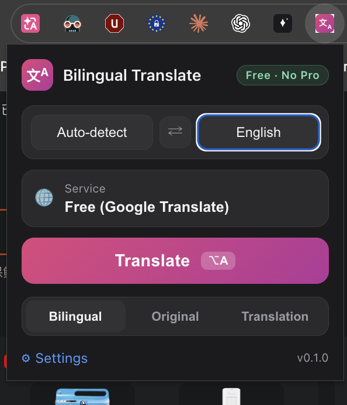
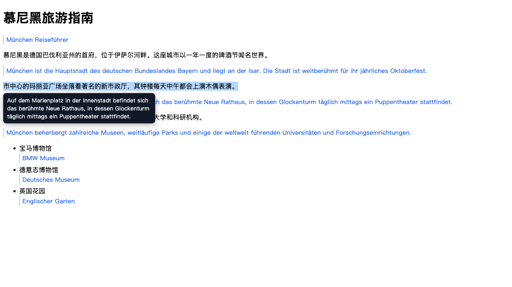
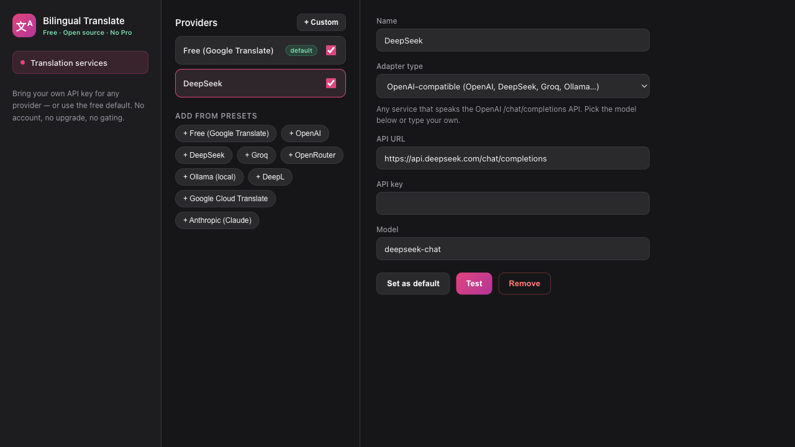

# Bilingual Translate

In-page translation, the way I wanted it. The original text stays where it is, and the
translation appears right below it. No switching tabs, no copy-paste into Google
Translate, no Pro tier, no account. You open a page, you read it in both languages.

It started as a Safari extension (that's why the repo name says Safari), and now runs
in Chrome too. Same codebase, one build.

## What it does

- Translates pages in place: every paragraph gets its translation injected under it,
  so you read the original and the translation at the same time.
- Select any text and a tooltip shows up with the translation.
- **Always translate this site**: tick the checkbox in the popup and the page
  translates itself on every load. No clicks.
- Keyboard shortcut: Alt+A (⌥A on Mac), rebindable in chrome://extensions/shortcuts.
- Three view modes: Bilingual, Original-only, Translation-only.
- Dynamic pages work. Infinite scroll, lazy-loaded content, whatever shows up later
  gets translated as it appears.
- Works out of the box: ships with a keyless Google Translate provider, so you can
  install it and translate immediately without signing up anywhere.
- Import/export your provider config as JSON (keys optional) to move between
  machines or share with a friend.





## Any AI provider, your own API keys

The translation backend is just data, nothing is hardcoded. Pick a preset or define
your own service in the settings:

- **Free (Google Translate)** — the keyless default.
- **OpenAI-compatible** — OpenAI, DeepSeek, Groq, OpenRouter, Together, or your local
  Ollama instance.
- **DeepL** and **Google Cloud Translate**.
- **Anthropic Claude**.

Every provider is just URL + key + model. You can add any service that speaks one of
these APIs, hit the Test button to check it, and set it as your default. Keys live in
your browser's local storage and are only ever sent to the provider you picked.
Nothing phones home. No accounts, no tracking, no telemetry, no "Pro" badge.



## Install (Chrome)

1. Clone or download the repo.
2. Open `chrome://extensions`, turn on Developer mode, click **Load unpacked**.
3. Pick the `chrome-dist/` folder.
4. Click the extension icon, choose your languages, hit **Translate**.

The settings page (right-click the icon → Options, or the gear in the popup) is where
you add providers and keys.

## Safari

The whole thing was built as a Safari Web Extension first, so the code is there too.
Safari requires a native app shell around web extensions, which you generate with
`xcrun safari-web-extension-converter` — the extension code itself is the same
`src/` tree. `build.js` produces a Safari-compatible bundle (IIFE, no ES modules).

## Develop

```bash
npm install        # in extension/
npm test           # 54 unit tests, pure logic, no browser needed
npm run build      # esbuild → dist/ (bundles + browser shim)
```

`chrome-dist/` is the same output, ready to load. `e2e/chrome-e2e.mjs` launches
Chrome for Testing with the extension loaded, translates a test page and checks the
result, so you can prove the build works before shipping it.

## Why the browser shim

The code uses the `browser.*` namespace, which is how Safari and Firefox roll. Chrome
doesn't define `browser` at all, so the build injects
`globalThis.browser ??= globalThis.chrome;` at the top of every bundle. One codebase,
both browsers, no fork.

## Notes

The keyless provider is Google's unofficial translate endpoint. Free, but unofficial,
and it could break one day. That's exactly why the bring-your-own-key providers exist:
pick whatever API you trust, and the extension doesn't care.

MIT licensed. If it saves you one tab switch a day, it already paid for itself.
